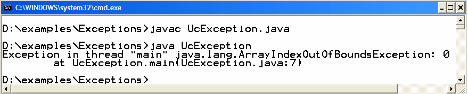
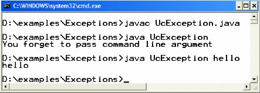
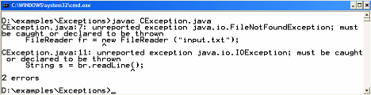
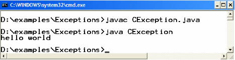
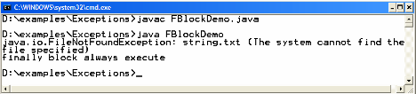
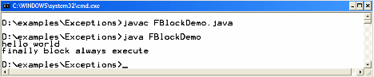

# Lab 1: Exception Handling

---
Course Name: Advanced Programming
Course Code: CPIT-305
Course Instructor: Dr. Rayan Mosli

---
## What is an Exception?

> **Definition:** An exception is an event, which occurs during the execution of a program that disrupts the normal flow of the program’s instructions.

## Unchecked Exceptions
**Example Code: UcException.java**

The following program takes one command line argument and prints it on the console

```java
// File UcException.java
public class UcException {
public static void main (String args[ ]) {
System.out.println(args[0]);
}
}
```
### Compile & Execute

If we compile & execute the above program without passing any command line argument, an ArrayIndexOutOfBoundsException would be thrown. This is shown in the following picture.



**Why?**

Since we have passed size of String args[ ] is zero, and we have tried to access the first element (first element has index zero) of this array.
From the output window, you can find out, which code line causes the exception to be raised. In the above example, it is
`System.out.println(args[0]);`

#### Modify UcException.java
Though it is not mandatory to handle unchecked exceptions we can still handle Unchecked Exceptions if we want to. These modifications are shown in bold.

```java
// File UcException.java
public class UcException {
public static void main(String args[]) {
try {
System.out.println(args[0]); }
catch (IndexOutOfBoundsException ex) {
System.out.println("You forget to pass command line argument");
}
}
```
The possible exception that can be thrown is *IndexOutOfBoundsException*, so we handle it in the catch block.

#### Compile & Execute



## Checked Exceptions

Example Code: `CException.java`
The following program reads a line (hello world) from a file and prints it on the console. The File reading code written inside the main read one line from a file and prints that to console.

```java
// File CException.java
import java.io.* ;
public class CException {
public static void main (String args[ ]) {
FileReader fr = new FileReader (“input.txt”);
BufferedReader br = new BufferedReader (fr);
//read the line from file
String line = br.readLine();
System.out.println(line);
}
}
```

#### Compile & Execute
If you try to compile this program, the program will not compile successfully and displays the message of unreported exception. This happens when there is code that can generate a checked exception but you have not handled that exception. Remember checked exceptions are detected by compiler. As we early discussed, without handling Checked exception, our program won’t compile.



#### Modify CException.java
As we have discussed earlier, it is mandatory to handle checked exceptions. In order to compile the code above, we modify the above program so that file reading code is placed inside a try block. The expected exception (IOException) that can be raised is caught in catch block.
```java
// File CException.java
import java.io.* ;
public class CException {
public static void main (String args[ ]) {
try{
FileReader fr = new FileReader (“input.txt”);
BufferedReader br = new BufferedReader (fr);
//read the line form file
String line = br.readLine();
System.out.println(line);
catch( IOExceptoin ex) {
System.out.println(ex);
}
}
}
```
The code line written inside the catch block will print the exception name on the console if exception occurs
Compile & Execute
After making changes to your program, it would compile successfully. On executing this program, hello world would be displayed on the console
Note: Before executing, make sure that a text file named input.txt must be placed in the same directory where the program is saved. Also write hello world in that file before saving it.



### The finally block
The finally block always executes regardless of exception is raised or not while as you remembered the catch block only executes when an exception is raised.


Exampel Code : FBlockDemo.java
```java
// File FBlockDemo.java
import java.io.* ;
public class FBlockDemo {
public static void main (String args[ ]) {
try{
FileReader fr = new FileReader (“strings.txt”);
BufferedReader br = new BufferedReader (fr);
//read the line form file
String line = br.readLine();
System.out.println(line);
catch( IOExceptoin ex) {
System.out.println(ex);
}
finally {
System.out.println(“finally block always execute”);
}
}
}
```
### Compile & Execute
The program above, will read one line from string.txt file. If string.txt is not present in the same directory the FileNotFoundException would be raised and catch block would execute as well as the finally block.



If string.txt is present there, no such exception would be raised but still finally block executes. This is shown in the following output diagram.



## Exercise:
Write a program in java that takes in a value from a user to find the square of an integer from 0 to 100. If the value is not an integer or within the range, then print the exception. 
